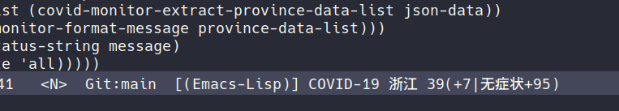

# Covid Monitor Mode 

此插件依赖 `curl`，所以确保系统中 `curl` 命令可以正常使用

首先在阿里云市场上注册申请疫情数据 API 服务（免费）
https://market.aliyun.com/products/57002003/cmapi00037970.html

找到自己的 APPCODE 设置 `covid-monitor-alicloud-api-appcode`

`covid-monitor-province-list` 用于配置省份

`covid-monitor-update-interval` 用于配置数据更新的间隔时间（单位秒，默认600）

配置示例:

    (use-package covid-monitor-mode
      :config
      (setq covid-monitor-alicloud-api-appcode "你的APPCODE")
      (setq covid-monitor-province-list '("浙江省"))
      (covid-monitor-mode))
